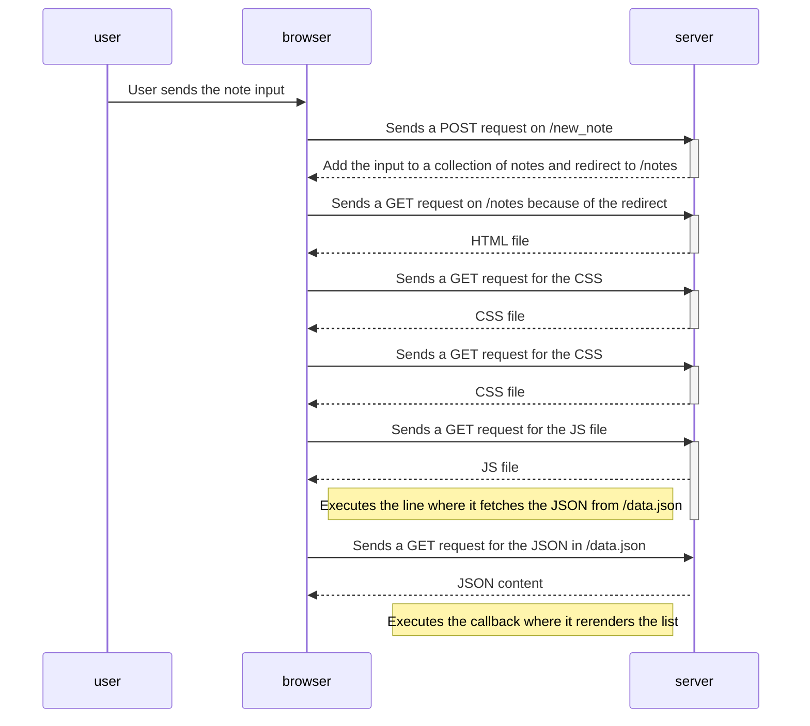

```mermaid
  sequenceDiagram
    participant user
    participant browser
    participant server

    user->>browser: User sends the note input

    browser->>server: Sends a POST request on /new_note
    activate server
    server-->>browser: Add the input to a collection of notes and redirect to /notes
    deactivate server

    browser->>server: Sends a GET request on /notes because of the redirect
    activate server
    server-->>browser: HTML file
    deactivate server

    browser->>server: Sends a GET request for the CSS
    activate server
    server-->>browser: CSS file
    deactivate server

    browser->>server: Sends a GET request for the CSS
    activate server
    server-->>browser: CSS file
    deactivate server

    browser->>server: Sends a GET request for the JS file
    activate server
    server-->>browser: JS file

    Note left of server: Executes the line where it fetches the JSON from /data.json
    deactivate server

    browser->>server: Sends a GET request for the JSON in /data.json
    activate server
    server-->>browser: JSON content 

    Note left of server: Executes the callback where it rerenders the list 
```