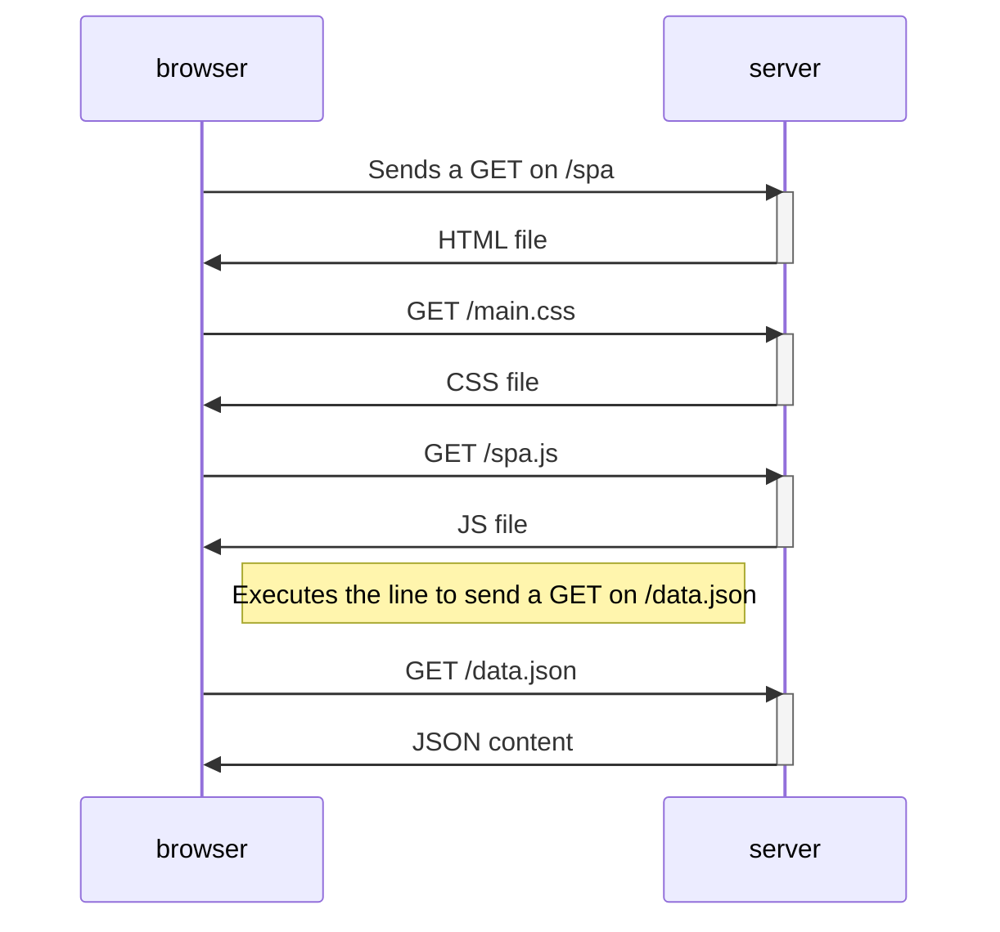

```mermaid
  sequenceDiagram
    participant browser
    participant server

    browser->>server: Sends a GET on /spa
    activate server
    server->>browser: HTML file
    deactivate server

    browser->>server: GET /main.css
    activate server
    server->>browser: CSS file
    deactivate server

    browser->>server: GET /spa.js
    activate server
    server->>browser: JS file
    deactivate server

    Note left of server: Executes the line to send a GET on /data.json

    browser->>server: GET /data.json
    activate server
    server->>browser: JSON content
    deactivate server
```